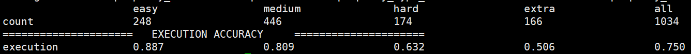

# StructGPT: A general framework for Large Language Model to Reason on Structured Data

This repo provides the source code & data of our paper: [StructGPT: A general framework for Large Language Model to Reason on Structured Data](https://arxiv.org/pdf/2305.09645.pdf) (Arxiv 2023).

```
@InProceedings{jiang-safe-2022,
  author =  {Jinhao Jiang, Kun Zhou, Zican Dong, Keming Ye, Wayne Xin Zhao and Ji-Rong Wen},
  title =   {StructGPT: A general framework for Large Language Model to Reason on Structured Data},
  year =    {2023},  
  journal={arXiv preprint arXiv:2305.09645},
  url={https://arxiv.org/pdf/2305.09645}
}
```


<p align="center">
  
</p>


## Usage
### 0. Requirements
You only need to install the python library and openai for querying OpenAI model API.

### 1. Prepare Dataset
<!-- We strongly suggest that download the processed datasets from [Here]() and then directly use them. -->
Apart from downloading from their original website, we use the processed datasets from [UnifiedSKG](https://github.com/HKUNLP/UnifiedSKG).
After downloading our processed data, you can unzip them and put them in the */data* directory.

### 3. Experiment
We have organized the running and evaluation scripts for each dataset under the */script* directory.

#### Evaluation on Text-to-SQL
For **Spider** dataset, you can directly use the following command to start running and output the evaluation results:
```bash
bash ./scripts/run_spider_wo_icl_v1.sh
```

<p align="center">
  
</p>

Similarly, you can run the corresponding script for **Spider-SYN** and **Spider-Realistic** to get the evaluation results.

**Spider_Realistic**
<p align="center">
  
</p>

**Spider-SYN**
<p align="center">
  
</p>
We save all the prediction file in *outputs/* directory.


**Note:**
Thanks for your attention. We currently update code for DB-based Text-to-SQL for interested researchers to quickly understand our StructGPT framework.
Code for TableQA will be coming tomorrow!
